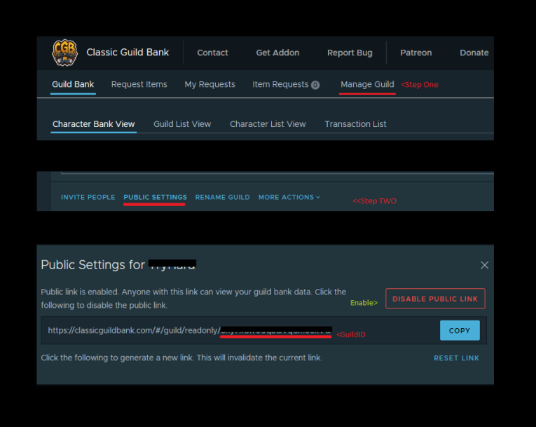
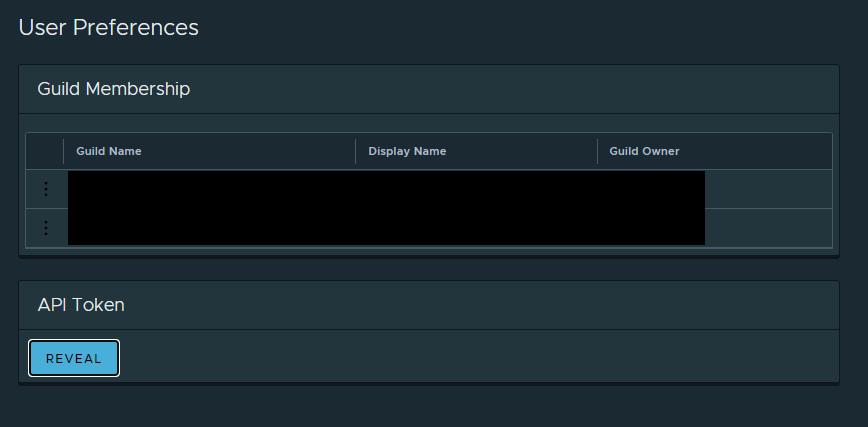

# Classic Guild Bank - Discord Bot 

This discord bot provides an easy integration for the World of Warcraft Classic Guild Bank Addon.
Just setup the bot and everyone on your server can request a report.

## Setup Bot

* [Invite](https://discordapp.com/api/oauth2/authorize?client_id=680461783399792677&permissions=10240&scope=bot) bot to your discord server 
* Run `!gb:help` to get help with individual commands
* Feel free to open an issue or pm me in discord for help :)

## Usage
### Option 1: Public Classic Guild Bank

* Get Guild Id from [ClassicGuildBank](https://classicguildbank.com) 
* Run `!gb:setGuild YOUR_GUILD_ID` to configure classic guild bank account

### Option 2: Private Classic Guild Bank

* Get API Token from [ClassicGuildBank](https://classicguildbank.com)
* Go to {UserName} > Preferences > API Token > Reveal and copy

* Run `!gb:setToken YOUR_API_TOKEN` to configure classic guild bank account

## Local Development Setup

* Install nodejs and npm
* Run `$ npm install`
* Generate Discord Bot Token at Discord Developer Portal [https://discord.com/developers]
* Copy `.env-example` -> `.env` (Use sqlite for local development)
* Run `$ npm watch` to start local development server
* Happy coding :)